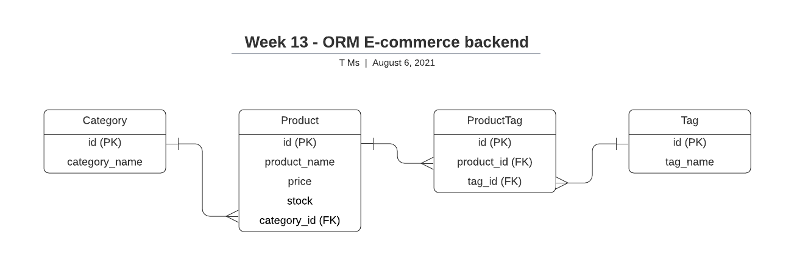
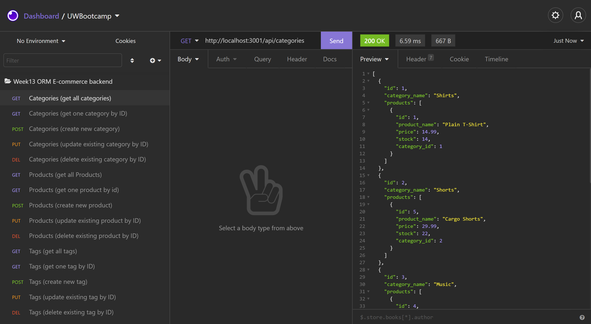

# Week13-ORM-Ecommerce-Backend

## Description

- This is a backend for an e-commerce site that uses Express.js and Sequelize to interact with a MySQL database.
- The application will not be deployed, and the acceptance criteria will be demonstrated via Insomnia.
- The schema and seeds create and populate MySQL Tables
- Database info is stored in a .env file
- When the server is started, the Sequelize models are synced to the database.

## Link to demo
- https://youtu.be/UrX3j5GhucI

## Database Design

## Routes (get all, get one, create, update, delete)
- /api/categories 
- /api/products
- /api/tags

## Insomnia Tests 
 

---